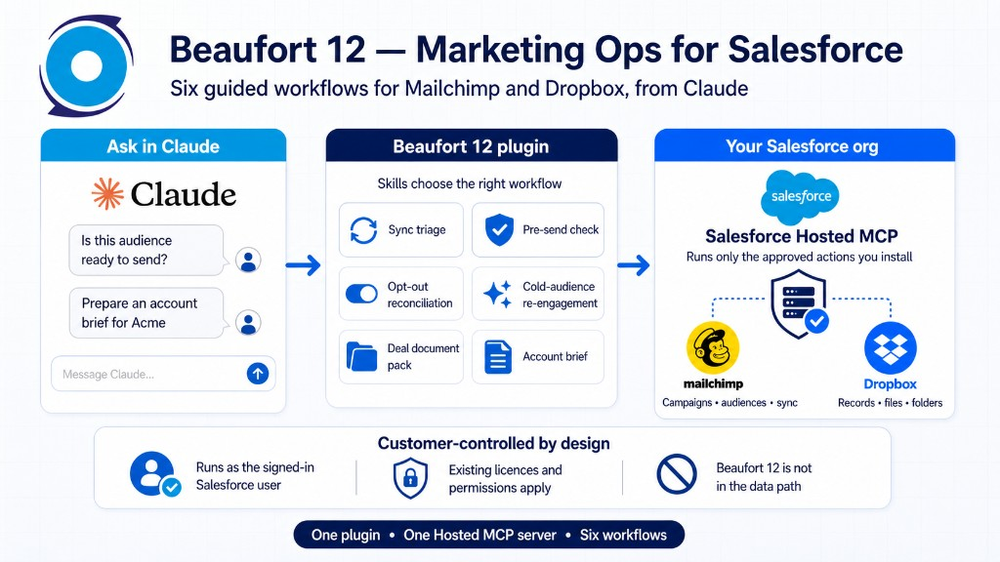

# Beaufort 12 — Marketing Ops for Salesforce

A [Claude](https://claude.com) plugin for Mailchimp and Dropbox work on
your Salesforce records. Skills decide the workflow. Your org's
[Salesforce Hosted MCP](https://help.salesforce.com) server supplies the
tools. Beaufort 12 is not in the data path.



## What you get

| Skill | When to use it |
| --- | --- |
| `sync-triage` | A contact or lead is not appearing in Mailchimp |
| `pre-send-check` | Deliverability and audience health before a send |
| `opt-out-reconciliation` | Salesforce opt-out and Mailchimp status disagree |
| `cold-audience-reengagement` | Build a re-engagement segment from stale members |
| `deal-document-pack` | Assemble the Dropbox files for an Opportunity |
| `account-brief` | Campaign engagement plus files on an Account |
| `audience-build` | Build and schedule a Data Wizard into an audience |

Install only the Apex actions you own on **one** Hosted MCP server. A
Mailchimp-only org never registers Dropbox tools.

## Try this

After [SETUP.md](SETUP.md), in a **new** chat:

```text
Give me an account brief on <Account>. Campaign engagement and the files on the record.
```

```text
We're sending a webinar invite on Thursday to <Audience name>. Is it safe to send?
```

```text
Build a Data Wizard that syncs Contacts into <Audience name>. I want Description to come across too. Run it now, then weekly on Mondays.
```

The audience in the last prompt must already exist in Mailchimp and have
synced. Do not ask Claude to "create an audience" — the package creates
a Data Wizard, not a Mailchimp audience.

The wizard prompt needs three Apex actions on the Hosted MCP server.
In Setup → MCP Servers → Add Tools → **Apex actions**, add the
namespaced classes:

- Suggest Mailchimp Wizard Field Mappings (`mone__McAgentSuggestWizardMappings`)
- Create Mailchimp Audience Merge Field (`mone__McAgentCreateAudienceMergeField`)
- Create Mailchimp Data Wizard (`mone__McAgentCreateDataWizard`)

Then disconnect, reconnect, and start a new chat. An old chat will not
see the new tools. If those three are missing, Claude cannot create the
wizard — it is not a UI-only feature.

## Install from this marketplace

In Claude Code:

```text
/plugin marketplace add beaufort12-code/beaufort12-plugin
/plugin install beaufort12@beaufort12
```

Then paste, when prompted:

- Salesforce Hosted MCP URL (`salesforce_mcp_url`)
- External Client App **Consumer Key** (`salesforce_oauth_client_id`)

Read [SETUP.md](SETUP.md) before you connect. The JWT named-user token
setting is easy to miss and produces a silent empty tool list. Without
the Consumer Key, Claude Code tries Dynamic Client Registration and
Salesforce returns `invalid_client`.

## Prerequisites

- At least one Beaufort 12 pair installed:
  - Mailchimp: Email Made Easy (Mailchimp) + Mailchimp for Agentforce
  - Dropbox: Dropbox for Salesforce + Dropbox for Agentforce
- Salesforce Hosted MCP enabled in the org
- An External Client App with `mcp_api` and **Issue JWT-based access
  tokens for named users** turned **on**

## Validate locally

```bash
claude plugin validate . --strict
```

## Directory submission

Submit the public GitHub URL via one of:

- [claude.ai plugin submit](https://claude.ai/admin-settings/directory/submissions/plugins/new)
- [Claude Console](https://platform.claude.com/plugins/submit)

After listing, pushes to this repo are picked up automatically.

## License

Apache-2.0. See [LICENSE](LICENSE).
